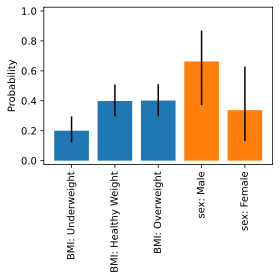
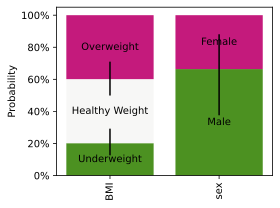
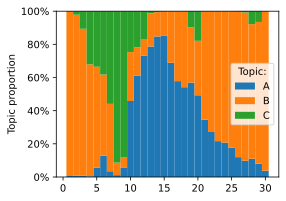
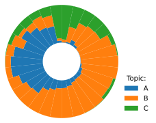
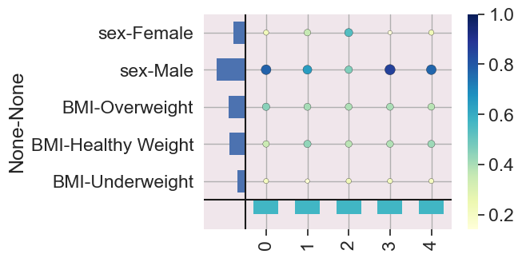

# latent-simplex-variable-visualizer
[Reference docs](dneijzen.github.io/latent-simplex-variable-visualizer)
Visualize latent variables obtained with latent Dirichlet methods (topic models)

## Installation
```
pip3 install toplot
```

## Getting started
After training your topic model with $K$ components, you've inferred two latent variables:
- The posterior over the weights of the model $\pmb{W} = [\pmb{w}_1, \dots, \pmb{w}_K]^T$. We assume that the weights have a two-level structure: each weight is composed of multiple sets of categories.
- Per example $i$, the posterior of the hidden units $\pmb{h}^{(i)}$ (also denoted as $\pmb{\theta}_i$ in LDA).

To visualise, we generate some "fake" weights $\pmb{W}$ from two sets, BMI and sex containing three and two categories each, respectively:
```python
import pandas as pd
from numpy.random import dirichlet

weights_bmi = dirichlet([16.0, 32.0, 32.0], size=1_000)
weights_sex = dirichlet([8.1, 4.1], size=1_000)
weights = pd.concat(
    {
        "BMI": pd.DataFrame(
            weights_bmi, columns=["Underweight", "Healthy Weight", "Overweight"]
        ),
        "sex": pd.DataFrame(weights_sex, columns=["Male", "Female"]),
    },
    axis="columns",
)
```
This is how you visualize `weights`, including the 95% quantile range:


```python
from toplot import bar_plot, bar_plot_folded

bar_plot(weights)
```

If you have many multinomials, you can reduce the size of the plot by folding the categories (e.g., "Underweight", "Healthy Weight", and "Overweight") belonging to the same multinomial (BMI) into a single bar


```python
bar_plot_stacked(weights)
```

Next, we plot the hidden units/topic identities $[\pmb{h}^{(1)}, \dots, \pmb{h}^{(m)}]^T$: that is, for each example/participant/document $i$, the proportion over the components/topics. Let's generate the (average) proportion for $m=30$ examples to visualize:
```python
hidden = pd.DataFrame(dirichlet([0.6, 0.8, 0.2], size=30), columns=["A", "B", "C"])
```
The function `plot_cohort` computes the distance between all examples (the cohort) and, by default, sorts them accordingly using the [travelling salesman problem](https://en.wikipedia.org/wiki/Travelling_salesman_problem).
Currently, no uncertainty visualization is supported for `plot_cohort` (like in `bar_plot`), so you need to pass the posterior average.


```python
from toplot import plot_cohort, plot_polar_cohort

plot_cohort(hidden)
```

You can emphasize the periodicity inherent in the travelling salesman solution by visualizing all the examples using a polar plot:


```python
plot_polar_cohort(hidden)
```

For the scattermap plot call:
```
from toplot import scattermap_plot

scattermap_plot(dataframe=weights, dataframe_counts=weights, marker_scaler=100)
```
Resulting in:

